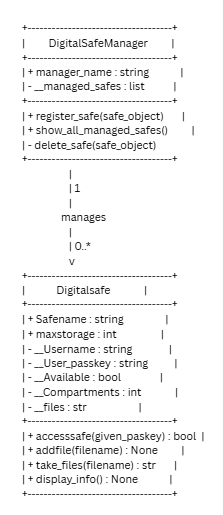
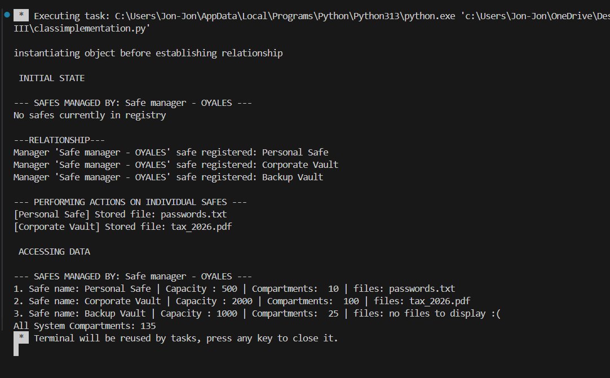
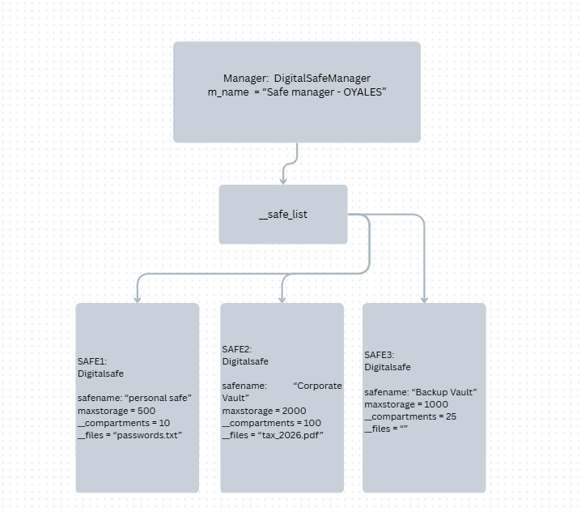

# Class Relationships: Association and Multiplicity

## Previous work
[PART 1](../OOP%20Act/classObjectUML.md)
[PART 2](../OOP%20Act%20II/classAttributesMethods.md)

## existing class
CLASS -- Digitalsafe
description --  makes a digital safe that the user can add files to

## new class
CLASS -- Safemanager
description -- manages all digital safes that tallies all existing safes

## Association
relationship -- safemanager manages Digitalsafe
                safe manager has a list of Digitalsafes that it can delete or create

## multiplicity
multiplicity -- 1 to 0... one to many
                one manager can oversee 0,1,and many

## UML class diagram

## python implementation
[PYTHON](classimplementation.py)

## test run

## OBJECT RELATIONSHIP DIAGRAM

## ANALYSIS
1. The association between safemanager and digitalsafe if 1 to 0.. as one to many. In the system the manager has control over multiple instances of digital safes acting. The safemanager can intereact with the digital safe by registering more, deleting and displaying all safes.
2. It is 1 to 0.. because this caan allow for more effecient use of the safes made by the class digitalsafe
3. The relationship relies on the list self.__safe_list . The class safemanager will will be able to communicate with the class digital by interacting with this it can make a new safe.
4. By storing the data it makes sure the data will be properly synched up to the original instance 
5. A list is appropriate because this can allow for an effecient solution to managing all the new instances
