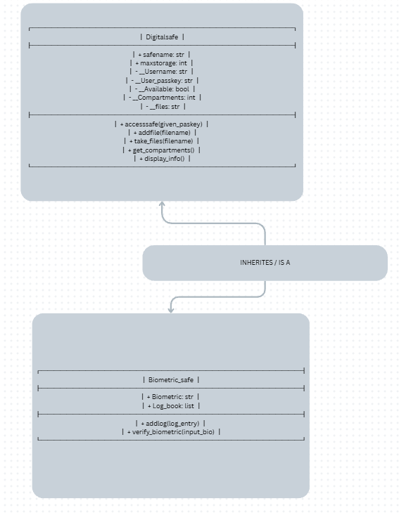
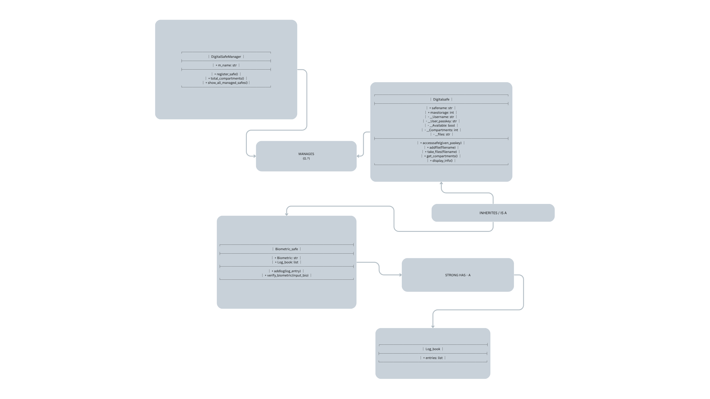
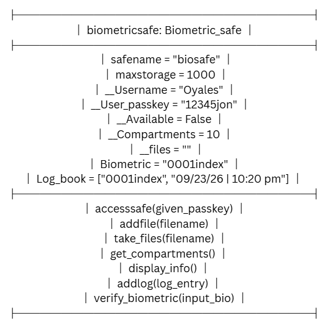

# Advanced Class Relationships 

## Previous Activities 
[Class mplementation](../OOP%20Act%20III/classimplementation.py) [Class Relationships](../OOP%20Act%20III/classRelationships.md) 

## Existing System Description: 
A biometric safe that is an upgrade to its parent class Digitalsafe which makes a basic safe but this one allows for biometrics as an alternative form of accessing the safe, since it is a child of the parent class Digital safe it performs all of its functions as before but with an added gimmick.

## Inheritance Relationship 
Parent: Digitalsafe
Child: Biometric_safe
Explanation: This class has an extra function to allow for an alternative way of accessing the safe beside inputting their passkey now its their biometric alongside it. 

## Inheritance UML 

## Composition/Aggregation 
Relationship: Composition Strong HAS-A
Explanation: The Biometric_safe class has an attribute log_book which stores data locally within it as a list and since it is instatiated with the safe's constructor it also gets deleted when the safe is deleted aswell.

## Advanced UML Diagram 

## Python Implementation 
[Source Code](advancedRelationships.py) 

## Test Run 
 

## Object Diagram 

## Reflection 
Answers: 

1. I chose this Inheritance relationship because i found it the most fitting for a digital safe class, Strong HAS-A will hols sensitive information which should absolutely not be left behind if the safe is destryoed so its only fitting. The child class is a type of the parent class because it inherites all the parents attributes and methods basically becoming it but different.

2. Inheritance makes it so i dont have to copy and paste the old code which is rather inefficient and instead makes us copy the parent as a template for the child class. The Attributes that were transferred along were safename, maxstorage, __username, User_passkey, __Compartments and the methods were accesssafe(), get_compartments,etc.

3. The relationship of biometric_safe and Log_book is composition, because the log_book is instatiated in the constructor of the safe which means when the safe is destroyed the Log_book is also destroyed. This also means they do not have full functionality when one does not exist or the other. Overall this is the most ideal situation for a digital safe.

4. Association from part III is a shoddy collaboration of 2 classes where both can technically exist without the other. Inheritance Establishes a strict hierarchy where one must exist first before the other can form this also has an inate property of ownership where the composite object has control over the entire generations after it.

5. My design follows the DRY principle by keeping all the core functions of a basic digital safe in the Digitalsafe class. Instead of duplicating it to all other iterations child classes can be made from it to reduce inefficiency. This effetively solves the problem of having to find copy and paste over and over to make a new class.

# LLM NOTES:

